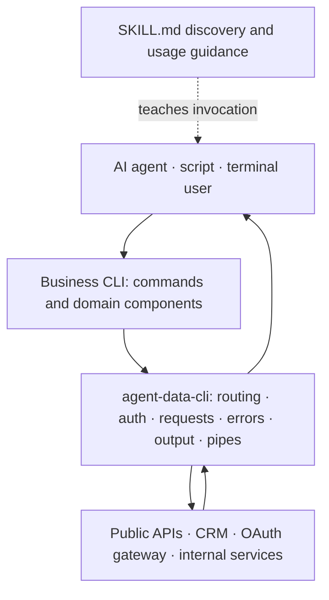

<div align="center">

# rxcli

**Build CLIs that AI agents can discover, call, compose, and recover from.**

A TypeScript framework for agent-native command-line tools, proven by real data and business CLIs.

[](LICENSE)
[](https://nodejs.org/)
[](https://pnpm.io/)

[English](README.md) · [中文](README.zh-CN.md)

[Why rxcli?](#why-rxcli) · [Ready-made CLIs](#ready-made-clis) · [Try it](#try-it-now) · [Build a CLI](#build-your-own-cli) · [Architecture](#architecture)

</div>

---

## Why rxcli?

`rxcli` is not another argument parser. It standardizes the boundary between a CLI and the agent, script, pipeline, or person calling it.

Most CLIs expose human-formatted text, ad-hoc errors, separate authentication code, and documentation that drifts away from the executable. That forces agents to guess: parse tables with regular expressions, infer whether a command failed, discover pagination conventions, and learn a different authentication flow for every tool.

With `@renxqoo/agent-data-cli`, a business package declares its commands and API calls once. The framework supplies the reusable agent-facing contract:

| Capability                              | What it gives you                                                                                                                                                     |
| --------------------------------------- | --------------------------------------------------------------------------------------------------------------------------------------------------------------------- |
| **Deterministic machine contract**      | JSON success envelopes, structured errors, stable sources, metadata, pagination, and categorized exit codes.                                                          |
| **One CLI for agents and humans**       | Pipes and CI receive JSON automatically; an interactive terminal receives readable text or CJK-width-aware tables. `--json` and `--no-json` make the choice explicit. |
| **Self-discovering Agent Skills**       | A CLI can list, read, generate, and sync its own `SKILL.md` documentation so agents know when and how to call it.                                                     |
| **Authentication as a component**       | Reuse credential providers, OAuth device flow, token refresh, generated auth commands, or plug in a business-specific scheme such as dual headers or HMAC.            |
| **Schema-first, type-safe commands**    | `defineCommand` infers required, optional, defaulted, and scalar argument types directly from the command schema.                                             |
| **Direct Zod structured input**         | Large and nested payloads use a Zod 4 schema directly for type inference, validation, discovery, redaction, dry-run, confirmation, and idempotency.          |
| **Composable by design**                | Structured stdout stays clean, diagnostics stay on stderr, and one command's envelope can become downstream pipe records.                                             |
| **Extensible without a framework fork** | Eight lifecycle hooks and plugin-contributed commands cover authentication, input auditing, request transformation, retries, output shaping, and error normalization. |

The repository includes public-data, financial-data, CRM, and OAuth-backed applications. They demonstrate that the same framework works across no-auth APIs, static multi-header authentication, and interactive OAuth—not just a toy example.

## The contract agents can rely on

In JSON mode, successful results are written to stdout:

```json
{
  "ok": true,
  "source": "orders",
  "data": [{ "id": "ORD-1001", "status": "paid" }],
  "meta": {
    "pagination": { "complete": false, "nextToken": "page-2" }
  }
}
```

Failures and diagnostics are written to stderr, with a non-zero exit code:

```json
{
  "ok": false,
  "error": {
    "type": "authentication",
    "subtype": "no_credentials",
    "message": "Login is required"
  }
}
```

| Exit code | Meaning                                               |
| --------- | ----------------------------------------------------- |
| `0`       | Success                                               |
| `1`       | API or server-side business error                     |
| `2`       | Invalid input                                         |
| `3`       | Authentication, authorization, or configuration error |
| `4`       | Network failure or timeout                            |
| `5`       | Internal framework error                              |
| `6`       | Policy or risk-control rejection                      |
| `10`      | An explicit confirmation such as `--yes` is required  |

This separation keeps shell pipelines valid and lets an agent choose recovery behavior without matching error-message text.

## Ready-made CLIs

Each active application supports one-step setup with `npx <package> install`, which installs the CLI, syncs its Agent Skills, and guides credential setup when needed. Node.js 20 or newer is required.

| CLI                           | Install                             | Authentication      | Why it matters                                                                                                                                    |
| ----------------------------- | ----------------------------------- | ------------------- | ------------------------------------------------------------------------------------------------------------------------------------------------- |
| [`rxstock`](apps/a-stock)     | `npx @renxqoo/rxstock install`      | None                | A-share quotes, K-lines, financials, sectors, capital flows, and locally computed indicators, with multi-source fallback.                         |
| [`rxopen`](apps/rxopen)       | `npx @renxqoo/rxopen-cli install`   | None                | More than 60 public-data endpoints for news, trends, weather, prices, translation, developer tools, and media, organized into six focused skills. |
| [`rxcordys`](apps/cordys-crm) | `npx @renxqoo/rxcordys-cli install` | Static dual headers | A full Lead-to-Cash CRM surface: leads, accounts, opportunities, contracts, payments, invoices, orders, approvals, and statistics.                |
| [`rxcli`](apps/crm)           | `npx @renxqoo/cli install`          | OAuth device flow   | Orders, products, invoices, and accounts through a company gateway, including registration, login, refresh, status, and logout.                   |

[`rx60s`](apps/60s) is the legacy single-skill package. New integrations should use `rxopen`, whose domain-oriented skill structure is easier for agents to discover accurately.

> `rxcli` requires an OAuth middleware layer. For local testing and development, deploy [renxqoo/auth-proxy](https://github.com/renxqoo/auth-proxy) and follow the [CRM testing guide](apps/crm/README.md#testing).

## Try it now

The public-data packages require no account, making them the quickest way to see the contract in action.

```bash
# Financial data with multi-source fallback
npx @renxqoo/rxstock quote 600519 --json
npx @renxqoo/rxstock stock diagnosis 300656 --json
npx @renxqoo/rxstock kline indicator 600519 --json

# News, weather, trends, and utilities
npx @renxqoo/rxopen-cli daily --json
npx @renxqoo/rxopen-cli life weather 杭州 --json
npx @renxqoo/rxopen-cli hot weibo --json
```

After installation, omit `--json` in an interactive terminal to get human-readable output:

```bash
npx @renxqoo/rxopen-cli install
rxopen life weather 杭州
```

## Build your own CLI

Install the framework:

```bash
pnpm add @renxqoo/agent-data-cli
```

Define a schema and implement only the business operation:

```ts
import { defineCli, defineCommand } from "@renxqoo/agent-data-cli";

interface TodoListResponse {
  items: Array<{ id: string; title: string; completed: boolean }>;
}

const list = defineCommand({
  name: "list",
  description: "List todos",
  args: {
    limit: {
      type: "number",
      default: 20,
      desc: "Maximum number of results",
    },
  },
  async run(args, ctx) {
    const response = await ctx.get<TodoListResponse>("/todos", {
      limit: args.limit,
    });

    return {
      data: response.data.items,
      meta: { count: response.data.items.length },
    };
  },
});

export default defineCli({
  name: "todos",
  binName: "todos",
  description: "Agent-native todo CLI",
  baseUrl: "https://api.example.com",
  commands: { list },
});
```

That definition provides argument parsing and validation, typed request helpers, automatic JSON/human output selection, structured errors, exit codes, pipe input, help, and a stable execution pipeline. See the [framework guide](packages/cli-sdk/README.md) for a complete executable entry point and advanced APIs.

### Add authentication without coupling it to commands

```ts
import { defineAuth, defineCli } from "@renxqoo/agent-data-cli";

const auth = await defineAuth({
  credentialNamespace: "todos",
  baseUrl: "https://auth.example.com",
  scope: "todos.read offline_access",
});

export default defineCli({
  name: "todos",
  description: "Authenticated todo CLI",
  plugins: [auth],
  commands: {},
});
```

The plugin contributes `auth login`, `auth status`, `auth logout`, and `auth register`. It also resolves credentials, adds authorization to requests, and performs a single shared refresh when concurrent requests receive `401` responses.

For custom behavior, plugins can use:

```text
beforeCommand → prepareRequest → observeRequest → handleUnauthorized
              → transformOutput → observeError → handleError
```

Plugins may also contribute commands through `provides`, which keeps cross-cutting features componentized instead of scattering them across business command files.

## Agent Skills are part of the executable

Skills are versioned beside the code and exposed by the CLI itself:

```bash
rxstock skills list
rxstock skills read rx-stock
rxstock skills sync
rxstock skills gen my-skill --init
```

`skills sync` always writes the Agent Skills standard path at `~/.agents/skills`. It also writes the detected installation paths for Claude Code, Codex, Cursor, ZCode, OpenClaw, and Pi Coding Agent. A business package can override these targets when it needs a different distribution policy.

This makes command discovery reproducible: the executable, its command schema, and the instructions an agent reads can evolve in the same release.

## Architecture



The boundary is deliberate:

- Business packages own domain language, API endpoints, response mapping, and human presentation.
- The framework owns invocation semantics, authentication lifecycle, transport, error taxonomy, output contracts, skills, and composition.
- Plugins own reusable cross-cutting components such as authentication, auditing, policies, and retries.

This keeps commands shallow and testable while concentrating complex behavior in reusable framework modules.

## Repository map

| Path                                             | Purpose                                                               |
| ------------------------------------------------ | --------------------------------------------------------------------- |
| [`packages/cli-sdk`](packages/cli-sdk)           | `@renxqoo/agent-data-cli`, the framework package                      |
| [`apps/a-stock`](apps/a-stock)                   | `rxstock`, A-share data and analysis                                  |
| [`apps/rxopen`](apps/rxopen)                     | `rxopen`, domain-oriented public-data CLI                             |
| [`apps/cordys-crm`](apps/cordys-crm)             | `rxcordys`, Cordys CRM CLI                                            |
| [`apps/crm`](apps/crm)                           | `rxcli`, OAuth-backed company business CLI                            |
| [`apps/60s`](apps/60s)                           | Legacy `rx60s` package                                                |
| [`packages/cli-sdk/docs`](packages/cli-sdk/docs) | Architecture, SDK, authentication, testing, and release documentation |

## Development and release quality

The monorepo uses pnpm, TypeScript, Vitest, and oxlint. Framework changes are developed with regression tests first, then verified against the real application packages.

```bash
pnpm install
pnpm build
pnpm typecheck
pnpm test
pnpm lint
pnpm publish:dry-run
```

Every version PR must update [`CHANGELOG.md`](CHANGELOG.md). Contribution and release expectations are documented in [`CONTRIBUTING.md`](CONTRIBUTING.md).

To add a business CLI, follow the framework's bundled [agent-cli-builder guide](packages/cli-sdk/skills/agent-cli-builder/SKILL.md). It covers command decomposition, authentication choices, output design, tests, skills, and installation.

## Data attribution

- [vikiboss/60s](https://github.com/vikiboss/60s) provides the upstream public-data APIs used by `rxopen` and `rx60s`. It is MIT-licensed and maintained by Viki.
- Tencent, Eastmoney, Sina, and 10jqka public market endpoints are data sources for `rxstock`.

Copyright in upstream data remains with its original source. This project provides command-line integrations and does not redistribute ownership of that data.

## License

[MIT](LICENSE) © [renxqoo](https://github.com/renxqoo)
