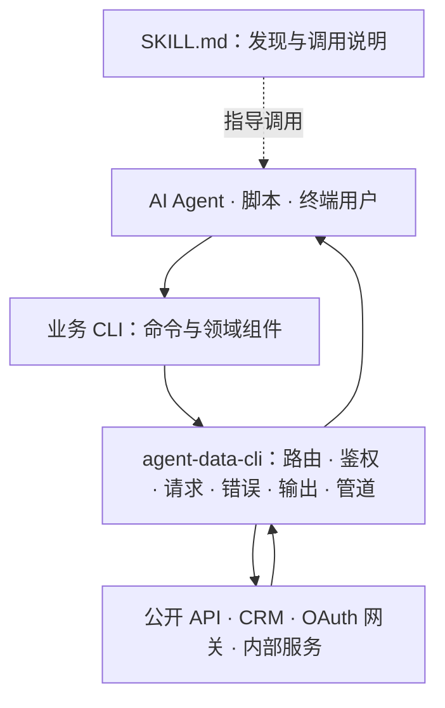

<div align="center">

# rxcli

**构建能被 AI Agent 自主发现、调用、组合并从错误中恢复的 CLI。**

一个面向 Agent 原生命令行工具的 TypeScript 框架，并由真实的数据与业务 CLI 持续验证。

[](LICENSE)
[](https://nodejs.org/)
[](https://pnpm.io/)

[English](README.md) · [中文](README.zh-CN.md)

[为什么选择 rxcli？](#为什么选择-rxcli) · [开箱即用的 CLI](#开箱即用的-cli) · [立即体验](#立即体验) · [构建自己的 CLI](#构建自己的-cli) · [架构](#架构)

</div>

---

## 为什么选择 rxcli？

`rxcli` 不只是另一个参数解析器。它统一了 CLI 与 AI Agent、脚本、流水线以及终端用户之间的交互边界。

传统 CLI 通常输出面向人的文本，错误格式各不相同，鉴权逻辑重复实现，文档也容易和可执行程序脱节。这会迫使 Agent 不断猜测：用正则解析表格、根据错误文字判断是否失败、推断分页规则，并为每个工具重新学习一套登录流程。

使用 `@renxqoo/agent-data-cli`，业务包只需要声明命令和 API 调用，框架负责提供可复用的 Agent 调用契约：

| 能力 | 带来的价值 |
| --- | --- |
| **确定性的机器契约** | 统一的 JSON 成功 envelope、结构化错误、稳定的数据源标识、元数据、分页信息和分类退出码。 |
| **Agent 与人共用一套 CLI** | 管道和 CI 自动获得 JSON；交互式终端获得易读文本或支持中日韩字符宽度的表格。也可通过 `--json`、`--no-json` 显式指定。 |
| **Agent Skill 自发现** | CLI 可以列出、读取、生成并同步自己的 `SKILL.md`，让 Agent 知道何时使用、如何调用。 |
| **组件化鉴权** | 复用凭证 Provider、OAuth Device Flow、Token 刷新和自动生成的鉴权命令，也可以接入双 Header、HMAC 等业务鉴权方案。 |
| **Schema 驱动的类型安全命令** | `defineCommand` 直接根据命令 Schema 推导必填、可选、默认值和基础参数类型。 |
| **直接使用 Zod 的结构化输入** | 大量或嵌套载荷直接用 Zod 4 完成类型推导、校验、发现、脱敏、dry-run、确认和幂等。 |
| **天然可组合** | 结构化 stdout 不受污染，诊断信息进入 stderr，一个命令的 envelope 可以自动转成下游管道记录。 |
| **无需修改框架即可扩展** | 八个生命周期 Hook 与插件贡献命令机制，可以实现鉴权、输入审计、请求转换、重试、输出转换和错误标准化。 |

仓库内包含公开数据、金融数据、CRM 和 OAuth 业务应用。这些真实项目证明了同一套框架可以覆盖免鉴权 API、静态多 Header 鉴权和交互式 OAuth，而不仅仅适用于演示项目。

## Agent 可以依赖的调用契约

在 JSON 模式下，成功结果写入 stdout：

```json
{
  "ok": true,
  "source": "orders",
  "data": [{ "id": "ORD-1001", "status": "paid" }],
  "meta": {
    "pagination": { "complete": false, "nextToken": "page-2" }
  }
}
```

失败和诊断信息写入 stderr，同时返回非零退出码：

```json
{
  "ok": false,
  "error": {
    "type": "authentication",
    "subtype": "no_credentials",
    "message": "Login is required"
  }
}
```

| 退出码 | 含义 |
| --- | --- |
| `0` | 成功 |
| `1` | API 或服务端业务错误 |
| `2` | 输入参数不合法 |
| `3` | 鉴权、授权或配置错误 |
| `4` | 网络故障或超时 |
| `5` | 框架内部错误 |
| `6` | 策略或风控拒绝 |
| `10` | 需要通过 `--yes` 等方式显式确认 |

这种分离方式可以保证 Shell 管道始终有效，也让 Agent 无需匹配错误文案就能选择正确的恢复策略。

## 开箱即用的 CLI

每个活跃应用都支持通过 `npx <package> install` 一键安装：安装 CLI、同步 Agent Skills，并在需要时引导配置凭证。要求 Node.js 20 或更高版本。

| CLI | 安装命令 | 鉴权方式 | 核心价值 |
| --- | --- | --- | --- |
| [`rxstock`](apps/a-stock) | `npx @renxqoo/rxstock install` | 无 | A 股行情、K 线、财务、板块、资金流和本地技术指标计算，并支持多数据源自动降级。 |
| [`rxopen`](apps/rxopen) | `npx @renxqoo/rxopen-cli install` | 无 | 新闻、热搜、天气、价格、翻译、开发工具和媒体等 60 多个公开数据接口，并按领域拆分为六个 Skill。 |
| [`rxcordys`](apps/cordys-crm) | `npx @renxqoo/rxcordys-cli install` | 静态双 Header | 完整的 Lead-to-Cash CRM 能力：线索、客户、商机、合同、回款、发票、订单、审批和统计。 |
| [`rxcli`](apps/crm) | `npx @renxqoo/cli install` | OAuth Device Flow | 通过公司网关访问订单、商品、发票和账号，并提供注册、登录、刷新、状态查询和退出能力。 |

[`rx60s`](apps/60s) 是旧版单 Skill 包。新接入应使用 `rxopen`，其按领域组织的 Skill 结构更便于 Agent 准确发现。

> `rxcli` 依赖 OAuth 中间层。本地测试和开发前需要部署 [renxqoo/auth-proxy](https://github.com/renxqoo/auth-proxy)，并参考 [CRM 测试指南](apps/crm/README.md#testing)。

## 立即体验

公开数据包不需要账号，是体验调用契约最快的方式。

```bash
# 金融数据，支持多数据源自动降级
npx @renxqoo/rxstock quote 600519 --json
npx @renxqoo/rxstock stock diagnosis 300656 --json
npx @renxqoo/rxstock kline indicator 600519 --json

# 新闻、天气、热搜与实用工具
npx @renxqoo/rxopen-cli daily --json
npx @renxqoo/rxopen-cli life weather 杭州 --json
npx @renxqoo/rxopen-cli hot weibo --json
```

完成安装后，在交互式终端中可以省略 `--json`，直接获得适合人阅读的输出：

```bash
npx @renxqoo/rxopen-cli install
rxopen life weather 杭州
```

## 构建自己的 CLI

安装框架：

```bash
pnpm add @renxqoo/agent-data-cli
```

声明参数 Schema，只实现业务操作：

```ts
import {
  defineCli,
  defineCommand,
} from "@renxqoo/agent-data-cli";

interface TodoListResponse {
  items: Array<{ id: string; title: string; completed: boolean }>;
}

const list = defineCommand({
  name: "list",
  description: "查询待办列表",
  args: {
    limit: {
      type: "number",
      default: 20,
      desc: "最大返回数量",
    },
  },
  async run(args, ctx) {
    const response = await ctx.get<TodoListResponse>("/todos", {
      limit: args.limit,
    });

    return {
      data: response.data.items,
      meta: { count: response.data.items.length },
    };
  },
});

export default defineCli({
  name: "todos",
  binName: "todos",
  description: "Agent 原生待办 CLI",
  baseUrl: "https://api.example.com",
  commands: { list },
});
```

这段定义自动获得参数解析与校验、类型化请求方法、JSON/人类可读输出自动选择、结构化错误、退出码、管道输入、帮助信息和稳定的执行流水线。完整可执行入口和进阶 API 请查看 [框架指南](packages/cli-sdk/README.zh-CN.md)。

### 添加与业务命令解耦的鉴权

```ts
import { defineAuth, defineCli } from "@renxqoo/agent-data-cli";

const auth = await defineAuth({
  credentialNamespace: "todos",
  baseUrl: "https://auth.example.com",
  scope: "todos.read offline_access",
});

export default defineCli({
  name: "todos",
  description: "带鉴权的待办 CLI",
  plugins: [auth],
  commands: {},
});
```

这个插件会自动贡献 `auth login`、`auth status`、`auth logout` 和 `auth register` 命令，同时负责解析凭证、为请求添加鉴权信息，并在并发请求遇到 `401` 时共享同一次 Token 刷新。

自定义插件可以使用以下生命周期：

```text
beforeCommand → beforeRequest → afterRequest → onUnauthorized
              → beforeOutput  → onError
```

插件还可以通过 `provides` 贡献命令，把鉴权、审计、策略等横切能力封装为组件，避免散落在各个业务命令文件中。

## Agent Skills 是可执行程序的一部分

Skill 与代码一起进行版本管理，并由 CLI 自身对外暴露：

```bash
rxstock skills list
rxstock skills read rx-stock
rxstock skills sync
rxstock skills gen my-skill --init
```

`skills sync` 始终写入 Agent Skills 标准目录 `~/.agents/skills`，并同步到已检测到的 Claude Code、Codex、Cursor、ZCode、OpenClaw 和 Pi Coding Agent 安装路径。业务包也可以覆盖这些目标，实现自己的分发策略。

这让命令发现变得可复现：可执行程序、命令 Schema 和 Agent 阅读的使用说明可以在同一个版本中共同演进。

## 架构



各层边界保持清晰：

- 业务包负责领域语言、API 端点、响应映射和面向人的展示。
- 框架负责调用语义、鉴权生命周期、传输、错误分类、输出契约、Skill 和组合能力。
- 插件负责鉴权、审计、策略、重试等可复用的横切组件。

这样既能让业务命令保持轻量、容易测试，也能把复杂行为集中到可复用的框架模块中。

## 仓库结构

| 路径 | 作用 |
| --- | --- |
| [`packages/cli-sdk`](packages/cli-sdk) | 框架包 `@renxqoo/agent-data-cli` |
| [`apps/a-stock`](apps/a-stock) | `rxstock`，A 股数据与分析 |
| [`apps/rxopen`](apps/rxopen) | `rxopen`，按领域组织的公开数据 CLI |
| [`apps/cordys-crm`](apps/cordys-crm) | `rxcordys`，Cordys CRM CLI |
| [`apps/crm`](apps/crm) | `rxcli`，基于 OAuth 的公司业务 CLI |
| [`apps/60s`](apps/60s) | 旧版 `rx60s` 包 |
| [`packages/cli-sdk/docs`](packages/cli-sdk/docs) | 架构、SDK、鉴权、测试与发布文档 |

## 开发与发布质量

Monorepo 使用 pnpm、TypeScript、Vitest 和 oxlint。框架变更先通过回归测试表达问题，再使用真实应用包进行验证。

```bash
pnpm install
pnpm build
pnpm typecheck
pnpm test
pnpm lint
pnpm publish:dry-run
```

每个版本 PR 都必须更新 [`CHANGELOG.md`](CHANGELOG.md)。贡献与发布要求请查看 [`CONTRIBUTING.md`](CONTRIBUTING.md)。

新增业务 CLI 时，请按照框架内置的 [agent-cli-builder 指南](packages/cli-sdk/agent-cli-builder-zh-CN/SKILL.md)进行。该指南覆盖命令拆分、鉴权选型、输出设计、测试、Skill 和安装流程。

## 数据来源说明

- [vikiboss/60s](https://github.com/vikiboss/60s) 提供 `rxopen` 和 `rx60s` 使用的上游公开数据 API，由 Viki 维护并采用 MIT License。
- 腾讯、东方财富、新浪和同花顺的公开行情端点是 `rxstock` 的数据来源。

上游数据的版权归原始来源所有，本项目提供命令行集成，不改变相关数据的权属。

## 许可证

[MIT](LICENSE) © [renxqoo](https://github.com/renxqoo)
